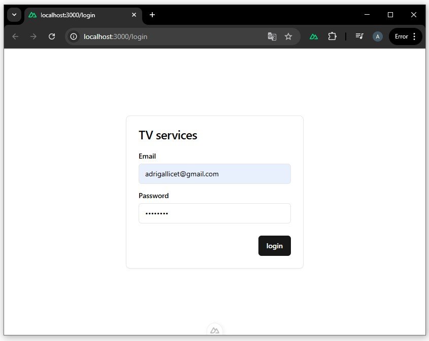

# 🔐 Autenticación

Este módulo gestiona el acceso de los usuarios a la API mediante autenticación basada en tokens JWT.


## Vista en la aplicación

  


### Relación con la API

Las pantallas de login y registro utilizan los siguientes métodos:

- `POST /login`
- `POST /register`
- `GET /verify`


## Endpoints disponibles

- `/login`
- `/register`
- `/verify`


## POST /login

Inicia sesión y devuelve un token JWT.

### Body
```json
{
  "email": "user@mail.com",
  "password": "password"
}
```
### Response 200
```json
{
  "status": "success",
  "token": "<jwt>",
  "userData": {
    "_id": "...",
    "name": "Juan",
    "email": "user@mail.com"
  }
}
```

### Errores

401 → Credenciales inválidas

## POST /register

Registra un nuevo usuario.

### Body
```json
{
  "name": "Juan",
  "email": "juan@mail.com",
  "password": "password"
}
```
### Response 200
```json
{
  "status": "success"
}
```
## GET /verify

Verifica si el token es válido.

### Headers
token: { jwt }

### Response 200

```json
{
  "status": "success"
}
```

<br>

⬅️ [Volver a indice](index.md) - [Usuarios](users.md) ➡️ 


