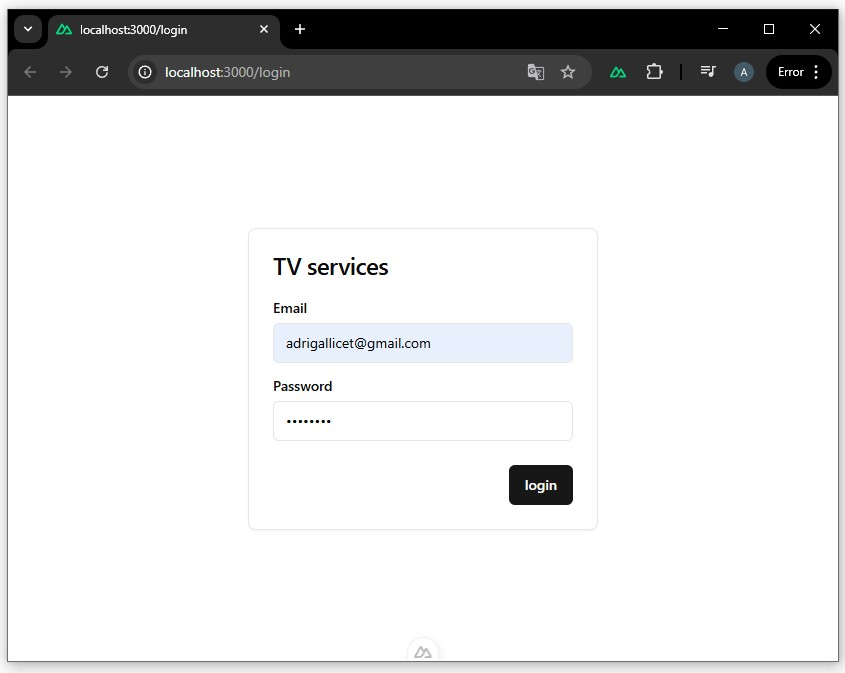

# 🔐 Autenticación

Este módulo gestiona el acceso de los usuarios a la API mediante autenticación basada en tokens JWT.


## Vista en la aplicación

  


### Relación con la API

Las pantallas de login y registro utilizan los siguientes métodos:

- `POST /login`
- `GET /verify`


## Endpoints disponibles

- `/login`
- `/verify`


## POST /login

- Inicia sesión
- Setea una cookie auth_token

### Body
```json
{
  "email": "user@mail.com",
  "password": "password"
}
```
### Response 200
```json
{
  "status": "success",
  "userData": {
    "_id": "...",
    "name": "Juan",
    "email": "user@mail.com"
  }
}
```

### Errores

401 → Credenciales inválidas
```json
{
  "status": "error",
  "error": "Invalid Credentials"
}
```
## GET /verify

Verifica si el usuario está autenticado y devuelve sus datos básicos

### Response 200

```json
{
  "status": "success",
  "userData": {
    "_id": "...",
    "name": "Juan",
    "email": "user@mail.com"
  }
}
```
### Errores
401 → credenciales invalidas
```json
{
  "status": "error",
  "error": { error }
}
```

<br>

⬅️ [Volver a Usuarios](users.md) - [Dispositivos](devices.md) ➡️ 


