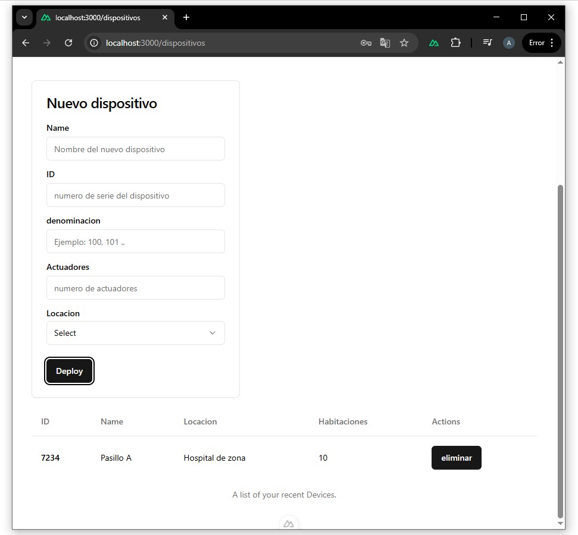

# 📟 Dispositivos

Este módulo permite gestionar los dispositivos IoT del sistema.  
Un dispositivo representa un equipo físico con uno o más actuadores, asociado a una ubicación.

## Vista en la aplicación




### Relación con la API

El formulario **Nuevo dispositivo** utiliza el endpoint:

- `POST /device`

Campos enviados:
- `name` → Nombre del dispositivo
- `dId` → Identificador único
- `denomination` → Código interno
- `actuators` → Número de actuadores
- `location` → ID de la locación


## Métodos disponibles

- `GET /device`
- `POST /device`
- `DELETE /device`


## GET /device

Obtiene todos los dispositivos registrados del usuario autenticado.

### Headers
token: { jwt }


### Response 200
```json
{
    "status": "success",
    "data": [
        {
            "_id": "687eac95e37a35affe53f0ea",
            "userId": "683a1f9413ca368f47a7b655",
            "dId": "7234",
            "name": "Pasillo A",
            "selected": false,
            "actuators": [
                {
                    "id": "100",
                    "value": false
                },
                {
                    "id": "101",
                    "value": false
                },
            ],
            "locationId": "687eaa45e37a35affe53f0e1",
            "locationName": "Hospital de zona",
            "createdTime": 1753132181486,
            "__v": 0
        }
    ]
}


```
### Errores

500 → Error de servidor
```json
{
  "status": "error",
  "error": error
}
```

## POST /device

Registra un nuevo dispositivo.

### Headers
token: { jwt }

### Body
```json
{
"newDevice": {
    "dId": "device-001",
    "name": "Sensor",
    "locationId": "123",
    "locationName": "Casa",
   "actuators": [
                {
                    "id": "100",
                    "value": false
                },
                {
                    "id": "101",
                    "value": false
                },
            ],
  }
}
```

### Response 200
```json
{
  "status": "success"
}
```

### Errores

500 → Error de servidor
```json
{
  "status": "error",
  "error": error
}
```


## DELETE /device

Elimina un dispositivo existente.
### Query Params
```
dId=device-001

Request completa:
http://localhost:3001/api/device?dId=device-001
```
### Response 200
```json
{
  "status": "success"
}
```
### Errores

500 → Error de servidor
```json
{
  "status": "error",
  "error": error
}
```
<br>

⬅️ [Volver a Usuarios](users.md) - [Locaciones](locations.md) ➡️ 


