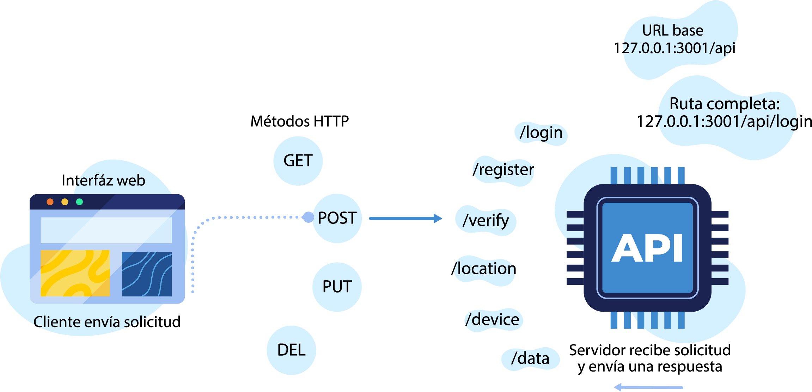

# 📡 API IoT

Documentación de la API REST para la gestión de usuarios, dispositivos IoT, locaciones y métricas.

## ¿Qué es una API REST?

Una **API REST** (Representational State Transfer) es una interfaz que permite que distintas aplicaciones se comuniquen entre sí a través de **HTTP**, utilizando reglas y convenciones simples.

En una API REST:

- Cada **recurso** (usuarios, dispositivos, datos, etc.) se accede mediante una **URL**
- Se utilizan los métodos HTTP estándar:
  - **GET** → obtener información
  - **POST** → crear información
  - **PUT** → actualizar información
  - **DELETE** → eliminar información
- Las respuestas suelen enviarse en formato **JSON**
- El servidor no guarda estado entre peticiones (stateless)

## ¿Cómo funciona esta API REST?
  

Ella permite:

- Registrar y autenticar usuarios
- Gestionar dispositivos IoT
- Asociar dispositivos a locaciones
- Almacenar y consultar generados por los dispositivos
- Exponer endpoints para integración con dispositivos IoT

Todas las peticiones se realizan sobre la siguiente URL base:

## 🌐 Base URL

http://127.0.0.1:3001/api

## 🔐 Autenticación

Esta API utiliza autenticación basada en JWT almacenado en cookies httpOnly.

- El cliente **no accede al token**
- El token se setea automáticamente al hacer login
- Las cookies se envían en cada request protegida
- No se utiliza localStorage

## 📦 Tecnologías

- Node.js
- Express
- MongoDB
- Mongoose
- JWT

## 📘 Contenido
- [👤 Usuarios](users.md)
- [🔐 Autenticación](auth.md)
- [📟 Dispositivos](devices.md)
- [📍 Locaciones](locations.md)
- [📊 Datos y métricas](data.md)
- [🔗 Webhooks](webhooks.md)
- [📦 Modelos](models.md)

 

   [Usuarios](users.md) ➡️ 

