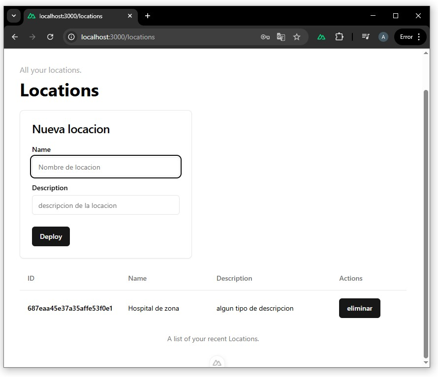

# 📍 Locaciones

Las locaciones representan los espacios físicos donde se encuentran los dispositivos, en el caso de uso:<br>
Hospitales, Clinicas, Cooperativas, etc.


## Vista en la aplicación

  

### Relación con la API

El módulo de locaciones del frontend utiliza los siguientes métodos al único endpoint:

- `GET /location` → Listar locaciones
- `POST /location` → Crear una locación, utilizado en el formulario
- `DELETE /location` → Eliminar una locación

- Los dispositivos se asocian a una locación existente.
- Las locaciones creadas luego pueden ser seleccionadas al registrar dispositivos.

## GET /location

Obtiene todas las locaciones del usuario autenticado.

### Headers
token: { jwt }


### Response 200
```json
{
    "status": "success",
    "data": [
        {
            "_id": "696cff98863211b9e6655b49",
            "userId": "696ceb77863211b9e6655b36",
            "name": "test",
            "description": "asdasd",
            "createdTime": 1768751000489,
            "devices": [],
            "__v": 0
        }
    ]
}
```
### Errores

401 → No autorizado

500 → Error de servidor

## POST /location
Crea una nueva locación.

### Headers
token: { jwt }


### Body
```json
{
  "location": {
    "name": "Hospital centenario",
    "description": "Oficina central"
  }
}

```

### Response 200
```json
{
  "status": "success"
}
```
### Errores

400 → Datos inválidos

500 → Error de servidor

## DELETE /location

Elimina una locación existente.

### Headers
token: { jwt }

Query params
```
locationId=<mongo_id>

URL completa:
http://localhost:3001/api/location?dId=locationId=<mongo_id>
```


### Response 200
```json
{
  "status": "success"
}
```

### Errores

401 → No autorizado

404 → Locación no encontrada

500 → Error de servidor
<br>

⬅️ [Volver a Dispositivos](devices.md) - [Datos y Métricas](data.md) ➡️ 
