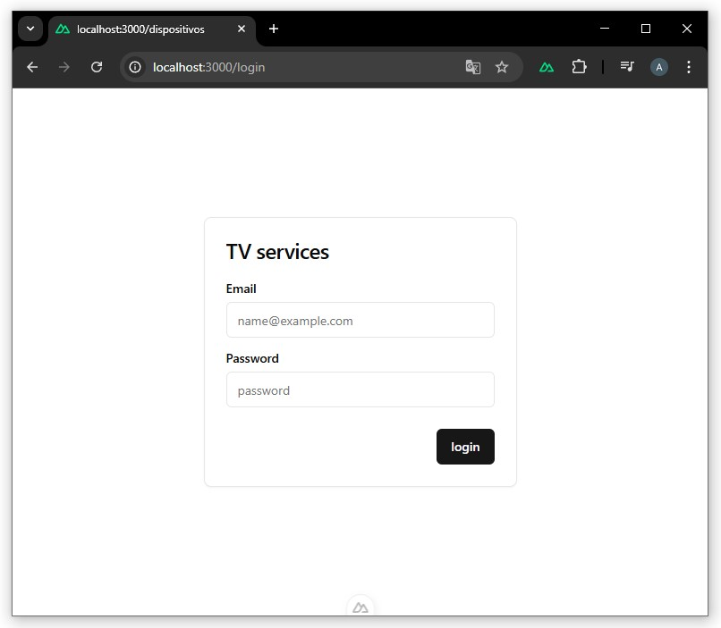

# 👤 Usuarios

## POST /register

Registra un nuevo usuario.

## Vista en la aplicación

  


### Body
```json
{
  "name": "Juan",
  "email": "juan@mail.com",
  "password": "password"
}
```
### Response 200
```json
{
  "status": "success"
}
```
### Errores
500 → Error de servidor
```json
{
  "status": "error",
  "error": { error }
}
```
<br>

⬅️ [Volver a Autenticacion](auth.md) - [Dispositivos](devices.md) ➡️ 

